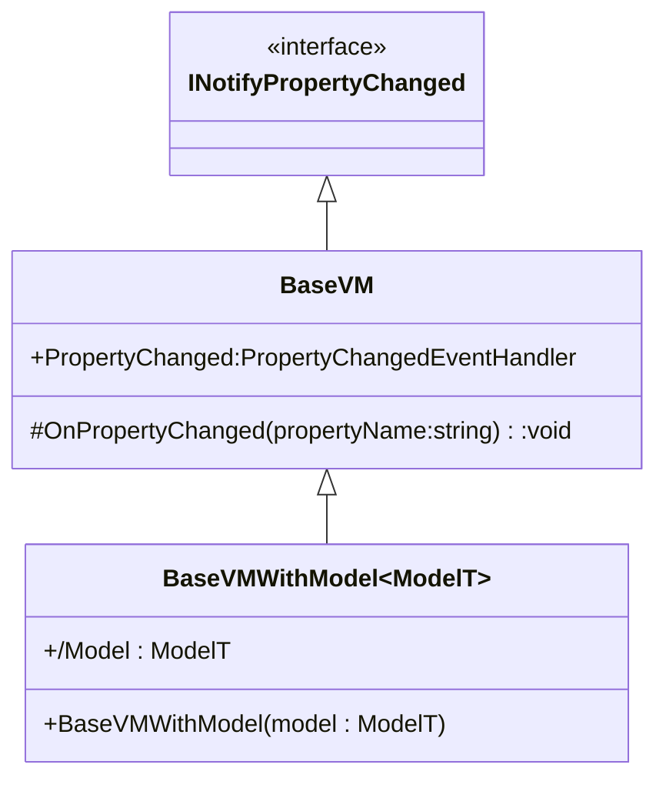
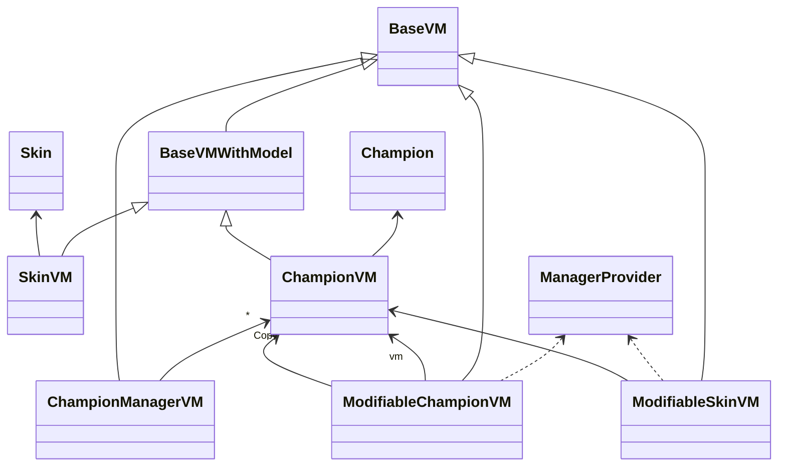
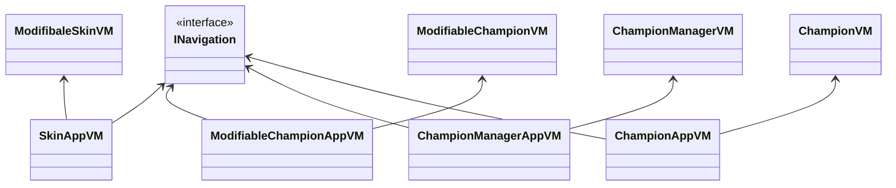

# Application .NET Maui de présentation des champions de league of legends

## Version 1 : MVVM Maison

Cette version est disponible sur la branche ```master```.

### Conception du Patron MMVM

Le patron MVVM permet de séparer efficacement la vue du model.
Le model contient les données, le ViewModel met à disposition des propriétés bindable et observable ainsi que des méthodes de mise à jour de ces propriétés. La vue se bind sur ces propriétés.

Dans ce projet, nous mettrons en place des classes ViewModel réutilisables pour d'autres projets qui auront simplement pour but de mettre à disposition des propriétés bindables en fonction de celles du Model, ainsi qu'une autre ViewModel applicative qui gérera les navigations et toute autre logique spécifique à la technologie utilisée pour la vue.

Mon choix pour le mettre en place a été de créer deux classes de base pour mes classes View Model dans un package ```MvvmToolkit```.



Ainsi, l'on peut dériver de `BaseVM` pour bénéficier du systeme de notification de changement de propriété ou de `BaseVMWithModel` pour également auto gérer une propriété du type du model.

#### ViewModel

Les classes ViewModel sont organisées comme tel :



#### ViewModel Applicative

Les classes ViewModel applicatives sont organisées comme tel :



## Travail réalisé :

* Ce qui fonctionne :
    * Liste des champions (master)
    * Pagination de la liste
    * Suppression et modification avec un Left Swipe
    * Page Champion (detail)
    * Ajout de champion
    * modification de champion (comprenant icone, image, classe, bio)
    * Visualisation et ajout de skins (nom et icone)
    * Visualisation et ajout de characteristiques
  
* Ce qui n'a pas été implémenté :
    * Suppression de charactéristique
    * Suppression / Modification de skins
    * Gestion des compétences


